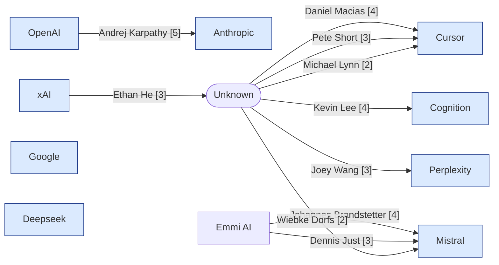

# Tech Personnel Movements Report — 2026-05-26

_Buckets: breaking (7d), recent (30d), context (90d). 9 organizations checked._

## Movement Map

## Top Movements
1. **[5] Anthropic** — OpenAI Co-Founder Andrej Karpathy Joins Anthropic to Lead Pretraining Research Group  _(breaking, personnel)_
2. **[4] Cursor** — Daniel Macias appointed Head of IT at Cursor  _(breaking, personnel)_
3. **[4] Mistral** — Johannes Brandstetter joins Mistral as VP of AI for Science  _(breaking, personnel)_
4. **[4] Cognition** — Kevin Lee Joins Cognition as Head of Deployed Engineering for APAC and Japan  _(breaking, personnel)_
5. **[3] xAI** — Ethan He departs xAI after leading Grok Imagine development  _(breaking, personnel)_
6. **[3] Perplexity** — Joey Wang joined Perplexity a year ago  _(breaking, personnel)_
7. **[3] Cursor** — Pete Short hired as A/NZ regional VP at Cursor  _(breaking, personnel)_
8. **[3] Mistral** — Dennis Just and Miks Mikelsons join Mistral's Science and Applied AI teams  _(breaking, personnel)_
9. **[2] Cursor** — Joey Wang joined Perplexity a year ago  _(breaking, personnel)_
10. **[2] Mistral** — Wiebke Dorfs joins Mistral as Senior Associate Public Affairs  _(breaking, personnel)_

## By Organization

### Anthropic
- **[5] personnel — breaking**: OpenAI Co-Founder Andrej Karpathy Joins Anthropic to Lead Pretraining Research Group
  Andrej Karpathy, former Tesla AI executive and OpenAI co-founder, joined Anthropic to lead a new group focused on using Claude to accelerate pretraining research. He joined Anthropic's pretraining team responsible for data training of Claude models. Originally at OpenAI, Karpathy moved from OpenAI to Anthropic.
  _Move: Andrej Karpathy | OpenAI → Anthropic_
  _Rubric: Founder-level and former Tesla AI executive joining as lead of research -> 5 per personnel rubric_
  _Date: 2026-05-19_
  _Confidence: high_
  Sources: https://www.wsj.com/tech/ai/andrej-karpathy-tesla-alum-and-openai-co-founder-joins-anthropic-c665f51f, https://www.reuters.com/business/autos-transportation/former-tesla-ai-executive-openai-founding-member-andrej-karpathy-joins-anthropic-2026-05-19/, https://techcrunch.com/2026/05/19/openai-co-founder-andrej-karpathy-joins-anthropics-pre-training-team/

### xAI
- **[3] personnel — breaking**: Ethan He departs xAI after leading Grok Imagine development
  Ethan He announced on LinkedIn that he has left xAI where he helped build the Grok Imagine AI model from scratch and led a team delivering multimodal video model features.
  _Move: Ethan He | xAI → ?_
  _Rubric: Named senior individual lead on major product build departing -> 3 per personnel rubric_
  _Date: 2026-05-20_
  _Confidence: low_
  Sources: https://www.linkedin.com/posts/ethanhe42_ive-left-xai-its-been-quite-a-journey-activity-7462921549721800705-vLG7

### Perplexity
- **[3] personnel — breaking**: Joey Wang joined Perplexity a year ago
  Joey Wang shared a LinkedIn post mentioning he joined Perplexity a year ago, building across agent and data infrastructure, evaluation platforms, experimentation frameworks, and applied AI.
  _Move: Joey Wang | ? → Perplexity_
  _Rubric: Named senior IC role (builds advanced AI systems) -> 3 per personnel rubric_
  _Date: around 2025-05_
  _Confidence: low_
  Sources: https://www.linkedin.com/posts/zeyu-joey-wang_a-year-ago-when-i-joined-perplexity-coding-activity-7464909249610035202-_6T-

### Cursor
- **[4] personnel — breaking**: Daniel Macias appointed Head of IT at Cursor
  Daniel Macias joined Cursor as Head of IT when the company had 80 employees and no IT infrastructure. Since his joining, the company grew to over 750 employees with a team of four IT staff under him.
  _Move: Daniel Macias | ? → Cursor_
  _Rubric: Head of IT is a senior leadership position -> 4 per personnel rubric_
  _Date: around 2026-05_
  _Confidence: low_
  Sources: https://www.linkedin.com/posts/andrei-serban_when-daniel-macias-joined-cursor-as-head-activity-7463268474828591104-cetj
- **[3] personnel — breaking**: Pete Short hired as A/NZ regional VP at Cursor
  Pete Short has been hired as the A/NZ regional Vice President at Cursor. Based in Sydney, he is tasked with building the business's go-to-market presence in the region and working with partners and customers.
  _Move: Pete Short | ? → Cursor_
  _Rubric: VP-level senior hire -> 3 per personnel rubric_
  _Date: around 2026-05_
  _Confidence: low_
  Sources: https://www.linkedin.com/posts/arn---australian-reseller-news_cursor-hires-pete-short-as-anz-head-arn-activity-7463490387039395840-NQF1
- **[2] personnel — breaking**: Joey Wang joined Perplexity a year ago
  Michael Lynn joined Cursor as an AI Adoption Engineer working in Customer Education. He has been a daily Cursor user for almost a year before joining.
  _Move: Michael Lynn | ? → Cursor_
  _Rubric: Senior individual contributor hire -> 2 per personnel rubric_
  _Date: around 2026-05_
  _Confidence: low_
  Sources: https://www.linkedin.com/posts/mlynn_exciting-news-ive-joined-cursor-as-an-activity-7463642179132104704-E0sD

### Mistral
- **[4] personnel — breaking**: Johannes Brandstetter joins Mistral as VP of AI for Science
  Johannes Brandstetter, co-founder and Chief Scientist of Emmi AI, joined Mistral AI as VP of AI for Science as part of Mistral's acquisition of Emmi AI in May 2026.
  _Move: Johannes Brandstetter | Emmi AI → Mistral_
  _Rubric: VP-level named senior hire -> 4 per personnel rubric_
  _Date: 2026-05_
  _Confidence: low_
  Sources: https://www.linkedin.com/posts/speedinvest_emmi-ai-joins-mistral-ai-in-one-of-europe-activity-7462402548310798336-WnqN
- **[3] personnel — breaking**: Dennis Just and Miks Mikelsons join Mistral's Science and Applied AI teams
  Dennis Just (CEO) and Miks Mikelsons (COO), co-founders of Emmi AI, joined Mistral's Science and Applied AI teams as part of the acquisition of Emmi AI in May 2026.
  _Move: Dennis Just | Emmi AI → Mistral_
  _Rubric: Named senior hire at director/VP level from startup co-founder -> 3 per personnel rubric_
  _Date: 2026-05_
  _Confidence: low_
  Sources: https://www.linkedin.com/posts/speedinvest_emmi-ai-joins-mistral-ai-in-one-of-europe-activity-7462402548310798336-WnqN
- **[2] personnel — breaking**: Wiebke Dorfs joins Mistral as Senior Associate Public Affairs
  Wiebke Dorfs joined Mistral AI as Senior Associate Public Affairs and moved to Paris in May 2026.
  _Move: Wiebke Dorfs | ? → Mistral_
  _Rubric: Senior individual contributor hire -> 2 per personnel rubric_
  _Date: 2026-05_
  _Confidence: low_
  Sources: https://www.linkedin.com/posts/wiebke-dorfs-1a3776177_new-chapter-last-week-i-joined-mistral-activity-7463263456452874240-PBEP

### Cognition
- **[4] personnel — breaking**: Kevin Lee Joins Cognition as Head of Deployed Engineering for APAC and Japan
  Kevin Lee has joined Cognition as the Head of Deployed Engineering for APAC and Japan, leading the forward deployed engineering team across these regions to work closely with customer engineering teams and drive deployment of Devin AI software engineer.
  _Move: Kevin Lee | ? → Cognition_
  _Rubric: C-suite level hire (Head of Deployed Engineering) -> 4 per personnel rubric_
  _Date: around 2026-05_
  _Confidence: low_
  Sources: https://www.linkedin.com/posts/naderdabit_cognition-is-hiring-forward-deployed-engineers-activity-7462496814919921664-HR-m

## Coverage Gaps
_None._

## Organizations With No Notable Movement
- Google
- Deepseek
