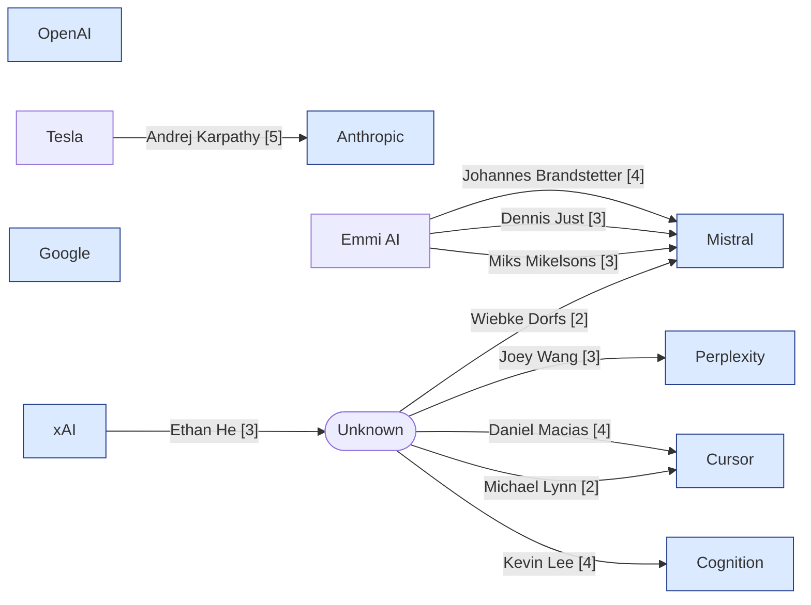

# Tech Personnel Movements Report — 2026-05-26

_Buckets: breaking (7d), recent (30d), context (90d). 8 organizations checked._

## Movement Map

## Top Movements
1. **[5] Anthropic** — Andrej Karpathy, OpenAI Co-founder and former Tesla AI executive, joins Anthropic to lead a new pretraining research group  _(breaking, personnel)_
2. **[4] Cursor** — Daniel Macias joined Cursor as Head of IT  _(breaking, personnel)_
3. **[4] Cognition** — Kevin Lee named Head of Deployed Engineering for APAC and Japan at Cognition  _(breaking, personnel)_
4. **[4] Mistral** — Johannes Brandstetter joins Mistral AI as VP of AI for Science  _(breaking, personnel)_
5. **[3] Mistral** — Dennis Just joins Mistral AI following Emmi AI acquisition  _(breaking, personnel)_
6. **[3] Mistral** — Miks Mikelsons joins Mistral AI after Emmi AI acquisition  _(breaking, personnel)_
7. **[3] xAI** — Ethan He leaves xAI after leading multimodal video model development  _(breaking, personnel)_
8. **[3] Perplexity** — Joey Wang reflects on one year at Perplexity coding and building AI products  _(breaking, personnel)_
9. **[2] Cursor** — Michael Lynn joined Cursor as AI Adoption Engineer  _(breaking, personnel)_
10. **[2] Mistral** — Wiebke Dorfs joins Mistral AI as Senior Associate Public Affairs  _(breaking, personnel)_

## By Organization

### Anthropic
- **[5] personnel — breaking**: Andrej Karpathy, OpenAI Co-founder and former Tesla AI executive, joins Anthropic to lead a new pretraining research group
  Andrej Karpathy, co-founder of OpenAI and former AI director at Tesla, joined Anthropic's pretraining team, leading a new group focused on accelerating pretraining research using Claude AI models. Originally from OpenAI and Tesla.
  _Move: Andrej Karpathy | Tesla → Anthropic_
  _Rubric: Founder-level move (OpenAI co-founder) to senior research lead -> 5 per personnel rubric_
  _Date: 2026-05-19_
  _Confidence: high_
  Sources: https://www.wsj.com/tech/ai/andrej-karpathy-tesla-alum-and-openai-co-founder-joins-anthropic-c665f51f, https://www.reuters.com/business/autos-transportation/former-tesla-ai-executive-openai-founding-member-andrej-karpathy-joins-anthropic-2026-05-19/, https://techcrunch.com/2026/05/19/openai-co-founder-andrej-karpathy-joins-anthropics-pre-training-team/, https://www.linkedin.com/posts/alexmsecurity_andrej-karpathy-joined-anthropic-youre-activity-7462654660357697536-yQli

### xAI
- **[3] personnel — breaking**: Ethan He leaves xAI after leading multimodal video model development
  Ethan He announced on LinkedIn that he has left xAI after joining during the early development of the Grok Imagine model. He led a team and contributed to shipping multimodal video and video extension models.
  _Move: Ethan He | xAI → ?_
  _Rubric: Named senior IC leading model development departing -> 3 per personnel rubric_
  _Date: 2026-05-20_
  _Confidence: low_
  Sources: https://www.linkedin.com/posts/ethanhe42_ive-left-xai-its-been-quite-a-journey-activity-7462921549721800705-vLG7

### Perplexity
- **[3] personnel — breaking**: Joey Wang reflects on one year at Perplexity coding and building AI products
  Joey Wang joined Perplexity a year ago and has been actively involved in coding agents, applied AI, and infrastructure development at the company since then.
  _Move: Joey Wang | ? → Perplexity_
  _Rubric: Named senior individual engineer involved in significant AI product work -> 3 per personnel rubric_
  _Date: around 2025-05_
  _Confidence: low_
  Sources: https://www.linkedin.com/posts/zeyu-joey-wang_a-year-ago-when-i-joined-perplexity-coding-activity-7464909249610035202-_6T-

### Cursor
- **[4] personnel — breaking**: Daniel Macias joined Cursor as Head of IT
  Daniel Macias joined Cursor as Head of IT and grew the team from no IT infrastructure with 80 employees to supporting over 750 employees with a small dedicated team leveraging AI automation.
  _Move: Daniel Macias | ? → Cursor_
  _Rubric: C-suite level 'Head of IT' hire -> 4 per personnel rubric_
  _Date: around 2026-05_
  _Confidence: low_
  Sources: https://www.linkedin.com/posts/andrei-serban_when-daniel-macias-joined-cursor-as-head-activity-7463268474828591104-cetj
- **[2] personnel — breaking**: Michael Lynn joined Cursor as AI Adoption Engineer
  Michael Lynn joined Cursor as an AI Adoption Engineer working in Customer Education. He had been a daily user for almost a year before joining.
  _Move: Michael Lynn | ? → Cursor_
  _Rubric: Senior IC hire -> 2 per personnel rubric_
  _Date: around 2026-05_
  _Confidence: low_
  Sources: https://www.linkedin.com/posts/mlynn_exciting-news-ive-joined-cursor-as-an-activity-7463642179132104704-E0sD

### Mistral
- **[4] personnel — breaking**: Johannes Brandstetter joins Mistral AI as VP of AI for Science
  Johannes Brandstetter, Co-founder and Chief Scientist of Emmi AI, joined Mistral AI as VP of AI for Science following Mistral's acquisition of Emmi AI in May 2026.
  _Move: Johannes Brandstetter | Emmi AI → Mistral_
  _Rubric: C-suite level move (VP) joining Mistral from acquired company -> 4 per personnel rubric._
  _Date: 2026-05_
  _Confidence: low_
  Sources: https://www.linkedin.com/posts/speedinvest_emmi-ai-joins-mistral-ai-in-one-of-europe-activity-7462402548310798336-WnqN
- **[3] personnel — breaking**: Dennis Just joins Mistral AI following Emmi AI acquisition
  Dennis Just, Co-founder and CEO of Emmi AI, joined Mistral AI as part of the science and applied AI team after Emmi AI was acquired by Mistral in May 2026.
  _Move: Dennis Just | Emmi AI → Mistral_
  _Rubric: Named senior leader (CEO of acquired company) joining scientific team at Mistral -> 3 per personnel rubric._
  _Date: 2026-05_
  _Confidence: low_
  Sources: https://www.linkedin.com/posts/speedinvest_emmi-ai-joins-mistral-ai-in-one-of-europe-activity-7462402548310798336-WnqN
- **[3] personnel — breaking**: Miks Mikelsons joins Mistral AI after Emmi AI acquisition
  Miks Mikelsons, Co-founder and COO of Emmi AI, joined Mistral AI's Science and Applied AI team as part of the May 2026 acquisition of Emmi AI by Mistral.
  _Move: Miks Mikelsons | Emmi AI → Mistral_
  _Rubric: Named senior leader (COO) from acquired company joining Mistral team -> 3 per personnel rubric._
  _Date: 2026-05_
  _Confidence: low_
  Sources: https://www.linkedin.com/posts/speedinvest_emmi-ai-joins-mistral-ai-in-one-of-europe-activity-7462402548310798336-WnqN
- **[2] personnel — breaking**: Wiebke Dorfs joins Mistral AI as Senior Associate Public Affairs
  Wiebke Dorfs joined Mistral AI as Senior Associate Public Affairs and relocated to Paris in May 2026.
  _Move: Wiebke Dorfs | ? → Mistral_
  _Rubric: Senior Associate level hire - minor notable hire -> 2 per personnel rubric._
  _Date: 2026-05_
  _Confidence: low_
  Sources: https://www.linkedin.com/posts/wiebke-dorfs-1a3776177_new-chapter-last-week-i-joined-mistral-activity-7463263456452874240-PBEP

### Cognition
- **[4] personnel — breaking**: Kevin Lee named Head of Deployed Engineering for APAC and Japan at Cognition
  Kevin Lee joined Cognition as Head of Deployed Engineering for APAC and Japan, leading the team to deploy Devin AI software with customers across Asia.
  _Move: Kevin Lee | ? → Cognition_
  _Rubric: Named C-suite or head-of-research equivalent level hire -> 4 per personnel rubric_
  _Date: around 2026-05_
  _Confidence: low_
  Sources: https://www.linkedin.com/posts/naderdabit_cognition-is-hiring-forward-deployed-engineers-activity-7462496814919921664-HR-m

## Coverage Gaps
_None._

## Organizations With No Notable Movement
- Google
