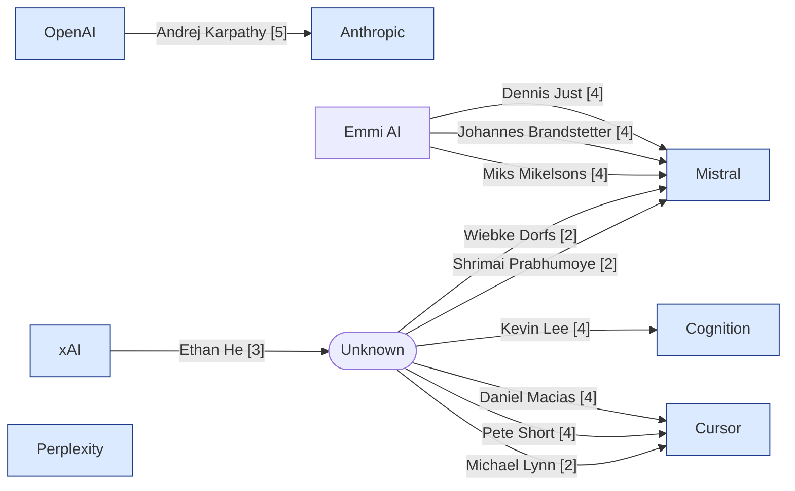

# Tech Personnel Movements Report — 2026-05-26

_Buckets: breaking (7d), recent (30d), context (90d). 7 organizations checked._

## Movement Map

## Top Movements
1. **[5] Anthropic** — Andrej Karpathy Joins Anthropic to Lead Pretraining Research Group  _(breaking, personnel)_
2. **[4] Cursor** — Daniel Macias joined Cursor as Head of IT  _(breaking, personnel)_
3. **[4] Cursor** — Pete Short hired as A/NZ regional VP  _(breaking, personnel)_
4. **[4] Mistral** — Dennis Just joins Mistral as part of Emmi AI acquisition  _(breaking, personnel)_
5. **[4] Mistral** — Johannes Brandstetter named VP of AI for Science at Mistral  _(breaking, personnel)_
6. **[4] Mistral** — Miks Mikelsons joins Mistral as COO as part of Emmi AI acquisition  _(breaking, personnel)_
7. **[4] Cognition** — Kevin Lee Joins Cognition as Head of Deployed Engineering for APAC and Japan  _(breaking, personnel)_
8. **[3] Cursor** — Ethan He Leaves xAI After Leading Grok Imagine Development  _(breaking, personnel)_
9. **[2] Mistral** — Wiebke Dorfs joins Mistral as Senior Associate Public Affairs  _(breaking, personnel)_
10. **[2] Cursor** — Michael Lynn joined Cursor as AI Adoption Engineer  _(breaking, personnel)_
11. **[2] Mistral** — Shrimai Prabhumoye joins Mistral focusing on LLM pretraining  _(recent, personnel)_

## By Organization

### Anthropic
- **[5] personnel — breaking**: Andrej Karpathy Joins Anthropic to Lead Pretraining Research Group
  Andrej Karpathy left OpenAI to join Anthropic's pretraining team to lead a new group focused on accelerating pretraining research for Claude AI models. Originally from Tesla, his move brings significant leadership experience to Anthropic.
  _Move: Andrej Karpathy | OpenAI → Anthropic_
  _Rubric: Founder-level departure -> 5 per personnel rubric_
  _Date: 2026-05-19_
  _Confidence: high_
  Sources: https://www.wsj.com/tech/ai/andrej-karpathy-tesla-alum-and-openai-co-founder-joins-anthropic-c665f51f, https://www.reuters.com/business/autos-transportation/former-tesla-ai-executive-openai-founding-member-andrej-karpathy-joins-anthropic-2026-05-19/, https://techcrunch.com/2026/05/19/openai-co-founder-andrej-karpathy-joins-anthropics-pre-training-team/

### Cursor
- **[4] personnel — breaking**: Daniel Macias joined Cursor as Head of IT
  Daniel Macias joined Cursor as Head of IT when the company had 80 employees and no IT infrastructure, leading the scaling up to 750+ employees with a team of four.
  _Move: Daniel Macias | ? → Cursor_
  _Rubric: C-suite level role hire -> 4 per personnel rubric_
  _Date: around 2026-05_
  _Confidence: low_
  Sources: https://www.linkedin.com/posts/andrei-serban_when-daniel-macias-joined-cursor-as-head-activity-7463268474828591104-cetj
- **[4] personnel — breaking**: Pete Short hired as A/NZ regional VP
  Pete Short was hired by Cursor as the Australia/New Zealand regional Vice President to build the business go-to-market presence in the region.
  _Move: Pete Short | ? → Cursor_
  _Rubric: C-suite, regional VP hire -> 4 per personnel rubric_
  _Date: around 2026-05-22_
  _Confidence: low_
  Sources: https://www.linkedin.com/posts/arn---australian-reseller-news_cursor-hires-pete-short-as-anz-head-arn-activity-7463490387039395840-NQF1
- **[3] personnel — breaking**: Ethan He Leaves xAI After Leading Grok Imagine Development
  Ethan He announced on LinkedIn that he left xAI after helping build the Grok Imagine multimodal video model from the ground up.
  _Move: Ethan He | xAI → ?_
  _Rubric: Named senior IC with leadership role on key xAI product -> 3 per personnel rubric_
  _Date: 2026-05-20_
  _Confidence: low_
  Sources: https://www.linkedin.com/posts/ethanhe42_ive-left-xai-its-been-quite-a-journey-activity-7462921549721800705-vLG7
- **[2] personnel — breaking**: Michael Lynn joined Cursor as AI Adoption Engineer
  Michael Lynn joined Cursor as an AI Adoption Engineer working in Customer Education after being a daily Cursor user for almost a year.
  _Move: Michael Lynn | ? → Cursor_
  _Rubric: Senior IC hire -> 2 per personnel rubric_
  _Date: around 2026-05-22_
  _Confidence: low_
  Sources: https://www.linkedin.com/posts/mlynn_exciting-news-ive-joined-cursor-as-an-activity-7463642179132104704-E0sD

### Mistral
- **[4] personnel — breaking**: Dennis Just joins Mistral as part of Emmi AI acquisition
  Dennis Just, Co-founder and CEO of Emmi AI, joined Mistral's Science and Applied AI team following the acquisition of Emmi AI in May 2026.
  _Move: Dennis Just | Emmi AI → Mistral_
  _Rubric: C-suite level hire (CEO-level founder join) -> 4 per personnel rubric_
  _Date: 2026-05_
  _Confidence: low_
  Sources: https://www.linkedin.com/posts/speedinvest_emmi-ai-joins-mistral-ai-in-one-of-europe-activity-7462402548310798336-WnqN
- **[4] personnel — breaking**: Johannes Brandstetter named VP of AI for Science at Mistral
  Johannes Brandstetter, Co-founder and Chief Scientist of Emmi AI, joined Mistral as VP of AI for Science following Mistral's acquisition of Emmi AI in May 2026.
  _Move: Johannes Brandstetter | Emmi AI → Mistral_
  _Rubric: C-suite level hire (VP) -> 4 per personnel rubric_
  _Date: 2026-05_
  _Confidence: low_
  Sources: https://www.linkedin.com/posts/speedinvest_emmi-ai-joins-mistral-ai-in-one-of-europe-activity-7462402548310798336-WnqN
- **[4] personnel — breaking**: Miks Mikelsons joins Mistral as COO as part of Emmi AI acquisition
  Miks Mikelsons, Co-founder and COO of Emmi AI, joined Mistral's Science and Applied AI team following the acquisition of Emmi AI in May 2026.
  _Move: Miks Mikelsons | Emmi AI → Mistral_
  _Rubric: C-suite hire (COO-level) -> 4 per personnel rubric_
  _Date: 2026-05_
  _Confidence: low_
  Sources: https://www.linkedin.com/posts/speedinvest_emmi-ai-joins-mistral-ai-in-one-of-europe-activity-7462402548310798336-WnqN
- **[2] personnel — breaking**: Wiebke Dorfs joins Mistral as Senior Associate Public Affairs
  Wiebke Dorfs joined Mistral AI as Senior Associate Public Affairs and relocated to Paris in May 2026.
  _Move: Wiebke Dorfs | ? → Mistral_
  _Rubric: Senior IC hire -> 2 per personnel rubric_
  _Date: 2026-05_
  _Confidence: low_
  Sources: https://www.linkedin.com/posts/wiebke-dorfs-1a3776177_new-chapter-last-week-i-joined-mistral-activity-7463263456452874240-PBEP
- **[2] personnel — recent**: Shrimai Prabhumoye joins Mistral focusing on LLM pretraining
  Shrimai Prabhumoye joined Mistral AI to focus on pretraining and advancing large language models capabilities.
  _Move: Shrimai Prabhumoye | ? → Mistral_
  _Rubric: Senior IC hire focused on research -> 2 per personnel rubric_
  _Date: 2026-05_
  _Confidence: low_
  Sources: https://www.linkedin.com/posts/shrimai-prabhumoye-b3757474_im-thrilled-to-share-that-ive-joined-mistral-activity-7454993368536883200-Qfcl

### Cognition
- **[4] personnel — breaking**: Kevin Lee Joins Cognition as Head of Deployed Engineering for APAC and Japan
  Kevin Lee has joined Cognition as the Head of Deployed Engineering for APAC and Japan, where he will build a deployed engineering team to work closely with customer engineering teams across Asia.
  _Move: Kevin Lee | ? → Cognition_
  _Rubric: Head of deployed engineering is a C-suite or head-of-research equivalent level role -> 4 per personnel rubric_
  _Date: around 2026-05_
  _Confidence: low_
  Sources: https://www.linkedin.com/posts/naderdabit_cognition-is-hiring-forward-deployed-engineers-activity-7462496814919921664-HR-m

## Coverage Gaps
_None._

## Organizations With No Notable Movement
- Perplexity
